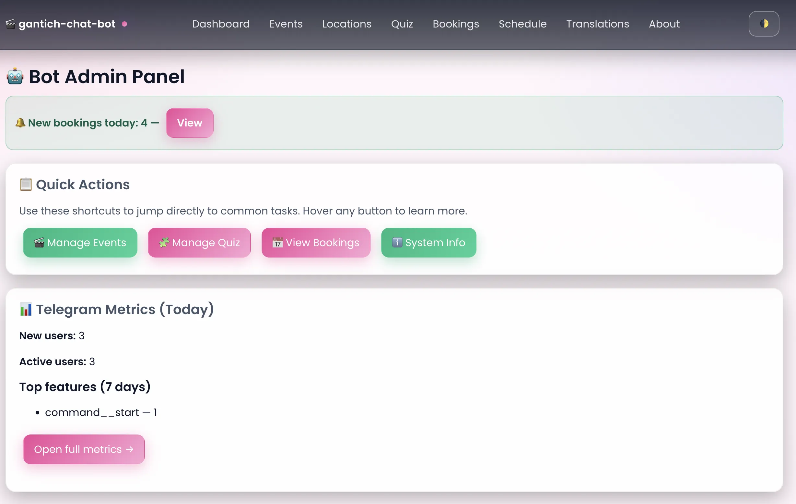

# Internal Telegram Bot (Booking, Sand Therapy, Online, Film Club) - written from scratch

Last updated: 2025-09-21

Internal project. Documentation is for our team; external contributions are not expected.

## What it does (very short)
- Telegram bot (aiogram 3) with booking flow, film club poster, simple quiz, and admin screens.
- Booking uses recurrent schedule rules and Firestore-backed bookings with collision checks.
- RU/EN texts with a minimal web admin for content and schedule.

## Run locally (quickest)
1) Copy .env.example to .env and set TELEGRAM_TOKEN (and optional WEB_USERNAME/WEB_PASSWORD for web admin).
2) Using Docker Compose (recommended):
   - docker compose up -d --build
   - Bot logs: docker compose logs -f bot
   - Firestore emulator: http://localhost:8081 (proxied)
3) Or run directly:
   - python -m venv .venv && source .venv/bin/activate
   - pip install -r requirements.txt
   - python -m src.main

## Configuration (env)
- TELEGRAM_TOKEN (required)
- ADMINS: comma-separated Telegram user IDs
- DEFAULT_LANG: ru|en (ru by default)
- WEB_USERNAME / WEB_PASSWORD: enable web admin (http://localhost:8080)
- USE_WEBHOOK, BASE_URL: optional for production webhooks

See .env.example for the full list.

## Web admin (built-in)
- Basic auth using WEB_USERNAME/WEB_PASSWORD
- Manage texts, schedule, locations, events
- Do not expose publicly without proper access control

## Data
- Bookings and schedule are stored in Firestore (emulator in compose) .
- Local JSON files under src/data are used only for small artifacts (e.g., quiz, texts/images metadata) and can be persisted when running in Compose or Cloud Run with GCS Fuse.
- Calendar/Calendly integration: current code has placeholders; no external calendar sync is performed yet.

## Deploy
- We use Google Cloud Run. See DEPLOY.md for a short, current guide and required repo variables/secrets.
- CI workflow: .github/workflows/cloud-run-deploy.yml builds and deploys to Artifact Registry → Cloud Run; sets Telegram webhook if BASE_URL/TELEGRAM_TOKEN are provided.

## Notes for developers
- Calendar/booking logic is in src/services/calendar_service.py and src/bot/booking_flow.py (simplified and normalized around the 'any' wildcard).
- Texts: src/i18n/texts.py. Templates: src/templates/.
- Keep dependencies pinned (requirements.txt).

## Screenshots

  
  
  

  
  
  

  
  
  

  
  
  

